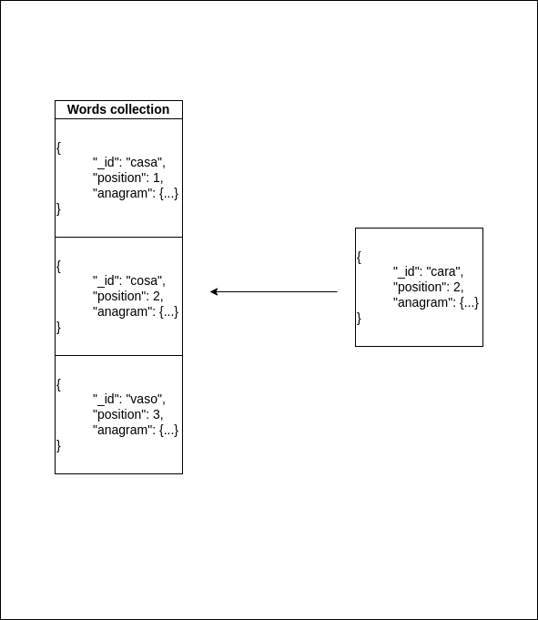

# WORDS API

*WORDS API* is a kind of **CRUD** for sorted words. As any other **CRUD** it allows you to create, retrieve, update and delete sorted words but you can also
find [anagrams](https://en.wikipedia.org/wiki/Anagram). You can find the **OpenAPI** doc in https://words-api.es/docs. You can also use this interactive documentation to test the API. Currently there are 
a lot of words stored in the database so you can test it from the very beggining. 

The requirements of the application can be summarized as follows:

    1. The API shall be developed using FastAPI or Flask.
    2. Persistance shall be achieved using MongoDB.
    3. Words shall be retrieved in the same order than the user provides via GET method.
    4. Words shall be stored via POST method. 
    4. Gaps are not allowed. In case an user provides an out of range position, the word will be stored as the last one.
    5. Order shall be updated via PATCH method
    6. Words shall be deleted via DELETE method
    7. Anagrams of any valid word shall be retrieved via GET method
    8. All the operations shall keep the order.

## Getting started

You can use the [already deployed version]( https://words-api.es/docs) or if you prefer you can run the application locally. In case you want to run it in your own computer, the easiest way to achieve it is using the `docker-compose.yml` file provided. Just run:
```shel
docker-compose up
```
and once the **API and DB** are up and running, the **WORDS API** will be reachable in the port 8080.

## API Design

The API has been designed following the *DDD (Domain Driven Design)* paradigm and the hexagonal architecture in order to develop a loosely coupled, testable and maintainable code.

### Data model

As DDD suggests, the bussiness logic of the API resides in the **domain layer**. Here, we can find all the required domain entities, value object, repositories and services to fulfill the requirements. 
The value objects have been modeled using dataclasses with their corresponding validation:

    * word: represents any of the stored word. It allows to store any word (upper or lower case) up to 23 characters because it is the length of longest word in spanish.
    * position: a positive integer for the order.
    * anagram: It is a word invariant represented by an ordered dict where keys are the letters and values are the frequency of the given letter. With this simple artifact, checking if 
    two words are anagrams is just a comparison.

But in this case, we can't handle all the bussiness logic in the domain layer. We need a persistance mechanism that allows us to store sorted elements. As MongoDB does not provide any native way to store sorted elements,
we need some workaround to accomplish this requirement. Well, this is not strictly true, we could use an array and if we wanted to scale up the application, we could apply some kind of bucketing to avoid the document 
size limitation. But this technique would made the insertion really complex so, our approach to solve is quite different. We use the *MongoDB transactions* (available since version 4.0) and we use a kind of 
**select for update** to get the last element in the list, then we insert the new word and increment the position field from inserted position (see the *gif* below).  



Although this data model is quite simple and makes it easy to accomplish all the requirements, we should take into account that inserting a new word implies to get a lock over the whole collection so, we can't achieve a high throughput for writings. But using the right indexes we can get pretty fast reading for both, sorted words and anagrams.

### Tests

Unit and validation tests are provided with the source code. For the unit tests, the *word repository* has been *mocked* using an in memory repository. If you want to run the unit tests locally, you will need to define the following environment variables:

| Variable              | Description           |     
|---                    |---                    |
| MONGO_URI             | MongoDB URI           |
| MONGO_USER            | MongoDB User          |
| MONGO_PASS            | MongoDB Pass          |
| WORDS_DB              | MongoDB Database      |
| WORDS_COLLECTION      | MongoDB Collection    |

and type the following commands in the root folder
```
python3.10 -m venv env
source env/bin/activate # Linux version
pip install -r requirements.txt
pytest
```
In case you want to run the validation tests, you will need to define `RUN_VALIDATION_TEST` as enviroment variable and ensure that you have an instance of MongoDB with the right configuration. It can be done running the 
development `docker-compose` as follows:
```
docker-compose -f docker-compose-dev.yml
```
